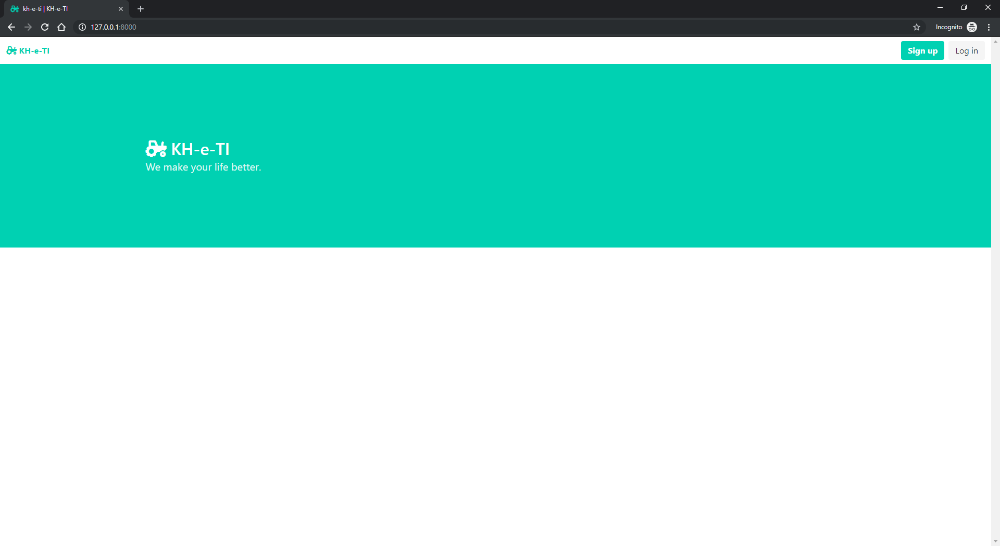

<p align="center">
    
</p>

<h2 align='center'>A platform for tractor renting for farmer</h2>
<br>
<p style="text-align:center">A web application that the farmers can use to hire tractors as well as other mechanizations at nominal amount all using their mobile device or computers. This would not only help them avoid manual labour but can be also considered as an important step to encourage this profession.</p>
<p style="text-align:center">This project was made as a Second year mini project for Python language.</p>


# Prerequisite

 This section contains all the technology required to make the working of the project smoother.

* #### step 1: Download [Python 3.7.2](https://www.python.org/downloads/)
<br>

* #### step 2: create a virtual environment
    Eg. Pipenv

    ```bash
        >>> pipenv install
    ```

    ##### NOTE: requirements mentioned in requirements.txt will be installed automatically
<br>

* #### step 3: Migrate the database
    Locate to the root of the project (i.e where manage.py is located).
    Then type the following command.
    
    ```bash
        >>> python manage.py makemigrations
        >>> python manage.py migrate
    ```
 <br>
  
* #### step 4: create superuser
    Superuser will be the main administrator who has access the admin page of the site.
    
    ```bash
        >>> python manage.py createsuperuser
    ```
    then, enter suitable phone number and password
    
    ##### NOTE: except for '123', only 10 digit phone number is allowed by default. This can be changed by updating the tuple named 'allowed_exceptional_phone_number' in 'users > validators.py'
    
<br>
  
* #### step 5: run the server
    To run the server type the following command.
    
    ```bash
        >>> python manage.py runserver
    ```
        
<br>
  
* #### step 6: run the site
    By default the site will be run on the localhost <b>'127.0.0.1/8000'</b>. Open any web browser and run go to that address.
    If everything is perfect you will see KH-e-TI font page.
    
    
    
    
# Environment variables

### [Stripe payment gateway](https://stripe.com/)

* STRIPE_PUBLISHABLE = 'your stripe publishable key'
* STRIPE_SECRET = 'your stripe secret key'


# Original Contributors

### [Deepak-Kharah](https://github.com/Deepak-Kharah)

### [RavenColEvol](https://github.com/RavenColEvol)

### [sachukundar](https://github.com/sachukundar)